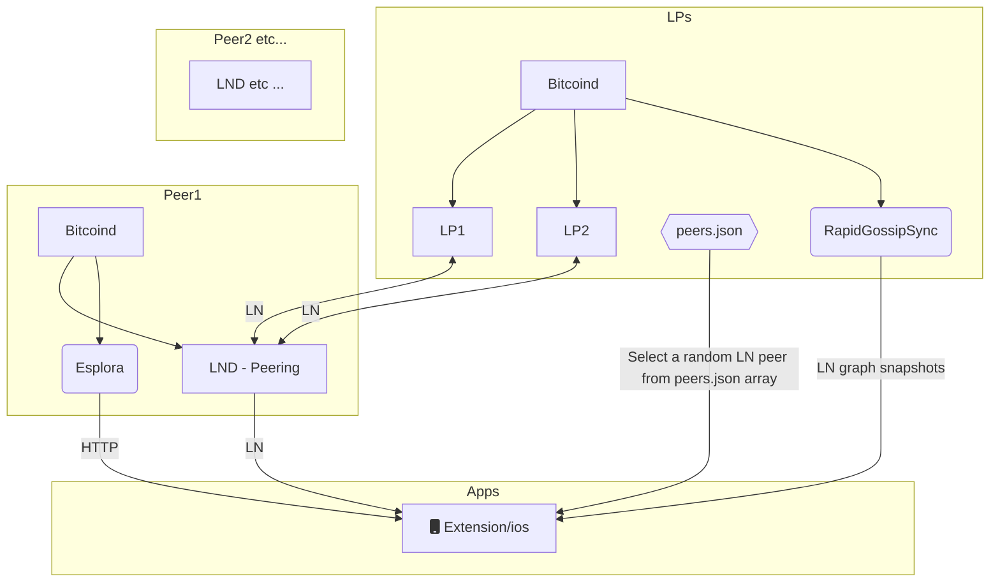

# infra

### current infra:

```mermaid
flowchart TD

    subgraph LPs
        Btc[Bitcoind]
        LND1[LP1]
        LND2[LP2]
        Peers{{peers.json}}
        Rgs(RapidGossipSync)
        Btc --> LND1
        Btc --> LND2
        Btc --> Rgs
    end

    subgraph Peer1
        Btc2[Bitcoind]
        LND22[LND - Peering]
        Esplora(Esplora)
        Btc2 --> LND22
        Btc2 --> Esplora

        LND1 <--> |LN| LND22
        LND2 <--> |LN| LND22
    end

    subgraph Apps
        App[fa:fa-mobile Extension/ios]

        Peers --> |Select a random LN peer from peers.json array| App
        LND22 --> |LN| App
        Esplora --> |HTTP| App
        Rgs --> |LN graph snapshots| App
    end

    subgraph Peer2 etc...
        B3[LND etc ...]
    end

```

### aspiration:

```mermaid
flowchart TD

    subgraph LiquidityProvider1
        BtcLP1[Bitcoind]
        LND1LP1[LND]
        BtcLP1 --> LND1LP1
    end

    subgraph LiquidityProvider2
        BtcLP2[Bitcoind]
        LND1LP2[LND]
        BtcLP2 --> LND1LP2
    end

    subgraph Router
        BTCR[Bitcoind]
        LNDRouter[LND - Routing]
        BTCR --> LNDRouter

        LND1LP1 <--> |LN| LNDRouter
        LND1LP2 <--> |LN| LNDRouter
    end

    subgraph Peer1
        Btc2[Bitcoind]
        LNDPeer[LND - Peering]
        Esplora(Esplora)
        Btc2 --> LNDPeer
        Btc2 --> Esplora
        LNDRouter <--> |LN| LNDPeer
    end

    subgraph RapidGossipSync
        Btc3[Bitcoind]
        RGS(RGS)
        Peers{{peers.json}}
        Btc3 --> RGS
    end

    subgraph Apps
        App[fa:fa-mobile Extension/ios]

        Peers --> |Select a random LN peer from peers.json array| App
        LNDPeer --> |LN| App
        Esplora --> |HTTP| App
        RGS --> |LN graph snapshots| App
    end

    subgraph Peer2
        B2[BTC ● LND ● Esplora]
    end
    subgraph Peer3
        B3[BTC ● LND ● Esplora]
    end
    subgraph Peer4
        B4[BTC ● LND ● Esplora]
    end

classDef btc fill:#331005
class BtcLP1 btc
class BtcLP2 btc
class Btc2 btc
class Btc3 btc
class BTCR btc

classDef lnd fill:#051b33
class LND1LP1 lnd
class LND1LP2 lnd
class LNDRouter lnd
class LNDPeer lnd

classDef rgs fill:#05330b
class Esplora rgs
class RGS rgs

classDef app fill:#2e3305
class App app

```
